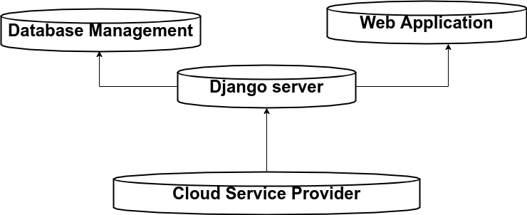
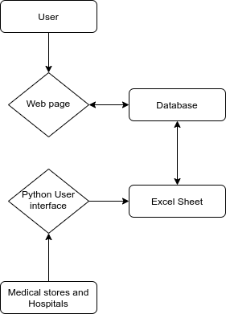

	
 
Medical supply monitoring tool for the Government of India (E-Yantra Covid Challenge 2020)

## About The Project

 
After a brief conversation with a WHO doctor, we aimed our project towards solving one of the major problems faced by all medical professionals and the common man alike, that is the inaccessibility of medical supplies due to inefficiency of data management. Supplies are available, but unfortunately what is lacking is the easy to access information on where exactly are they available. Our main focus while developing this system has been towards getting an accurate data at high computation speeds while ensuring maximum ease of access for the simplest of users.

### Modules of the Project
 - **Python user interface for medical stores and hospitals**
	* All suppliers will register with a unique username and password which will be used to log into the system there after.
	* The system is used to input data into the main database, directly from an excel sheet, which auto sorts required columns and eliminates the futile data. 
 - **Web servers**
	* This module solely caters to the common man who wants to purchase medical supplies. 
	* Rather than searching multiple stores and increasing his risk of acquiring the COVID-19, he gets perfect information of availability and location of his medical supplies
	* The user browses to "COVID-19supplies.in", and enters the location and required supply which will auto filter all the stores in his range, and give him most optimal store location. 

## Usage
 - This decreases time of exposure of the general public with other people, decreasing the chance of acquiring COVID-19
 - It is a very efficient inventory management system for all medical stores
 - It automatically filters out the medical supplies unrelated to COVID-19 decreasing the computation time, giving the user faster responses.

### Software Requirements
 - **Internet**
	* A stable internet connection for accessibility.
 - **Server**
 	* A web service platform to update, compute and access data efficiently
 - **Heroku**

### Software Packages used 
* Django
* HTML-CSS Web Dev
* Python - Tkinter user interface
* SQLite3 Database

### Architecture

   

## YouTube Video

<a href="https://youtu.be/dl6NbeQR7V0">E-Yantra Presentation Video</a>
<a href="https://youtu.be/MmF-A-gY12Y">Demo Video</a>

